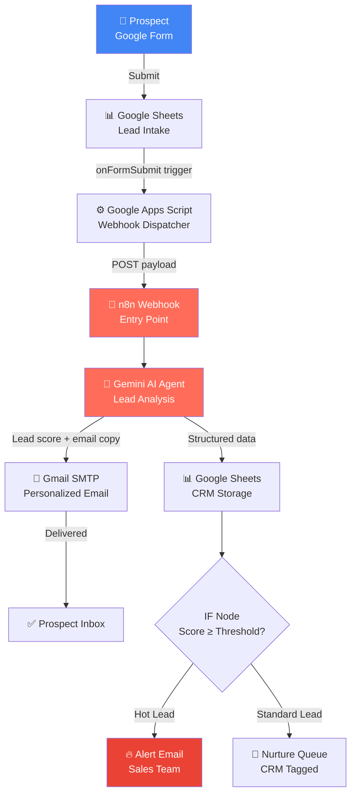
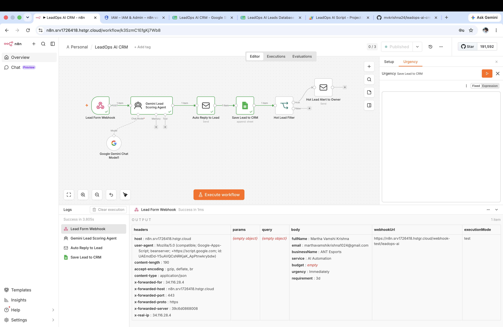
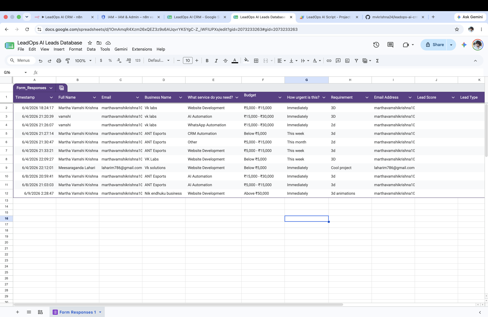
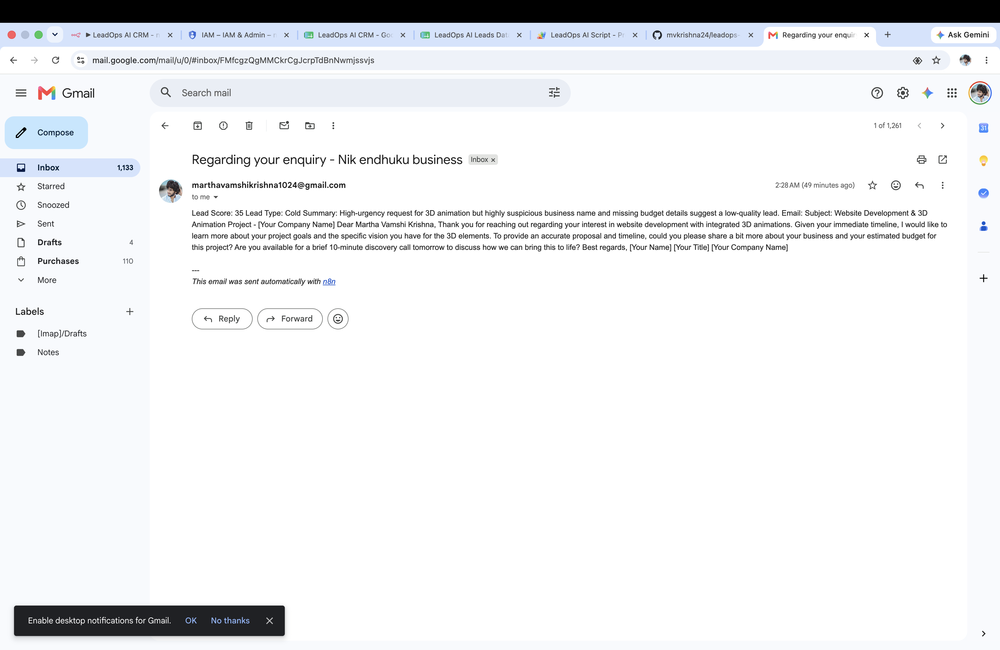
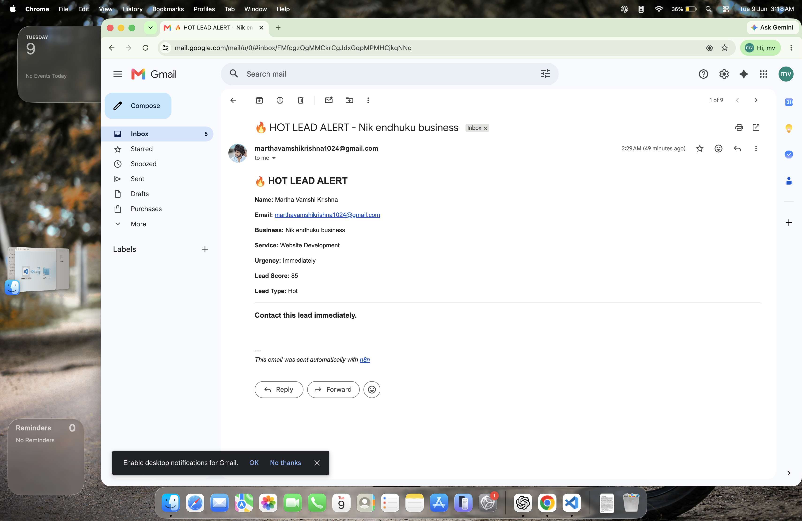
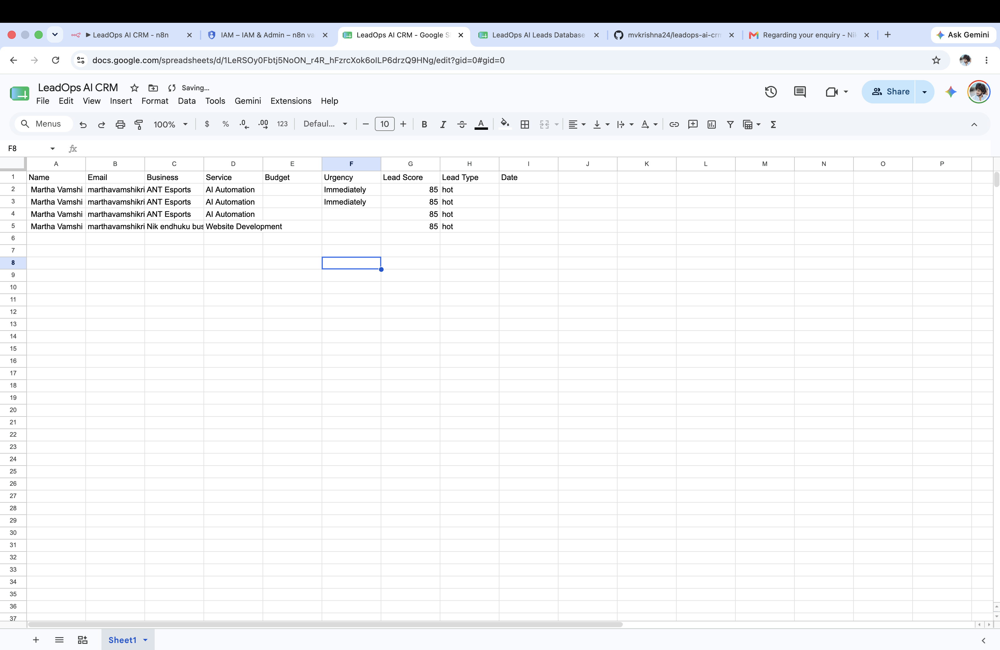

<div align="center">

# 🚀 LeadOps AI CRM

### AI-powered lead qualification and outreach automation platform

[](https://n8n.io)
[](https://ai.google.dev)
[](https://sheets.google.com)
[](https://github.com/vamshikrishna1024/leadops-ai-crm)
[](LICENSE)

<br/>

> **Production-grade AI automation that qualifies leads, generates personalized outreach emails, and routes hot prospects — all within seconds of form submission. Zero human intervention required.**

<br/>

[📸 Screenshots](#screenshots) · [🏗️ Architecture](#architecture) · [⚡ Features](#features) · [🚀 Demo](#demo) · [📋 Setup](#setup) · [🗺️ Roadmap](#roadmap)

</div>

---

## 📌 What This Is

LeadOps AI CRM is a **fully automated lead management pipeline** I built and deployed to production. When a prospect submits a form, the system:

1. Captures the lead via Google Forms → Google Sheets
2. Triggers a webhook in n8n via Google Apps Script
3. Routes the data through a **Gemini AI agent** that reads the lead's profile, intent, and context
4. Generates a **personalized outreach email** (not a template — actual AI-written copy)
5. Sends the email automatically via Gmail SMTP
6. Stores structured lead data in a Google Sheets CRM
7. Fires a **Hot Lead Alert** to the sales inbox if the lead scores above threshold

**Total time from form submission to email in prospect's inbox: < 10 seconds.**

---

## 🎬 Demo

### End-to-End Flow

```
Prospect fills form (mobile/desktop)
         │
         ▼
   Google Sheets logs entry
         │
         ▼
  Apps Script fires webhook
         │
         ▼
     n8n receives payload
         │
         ▼
  Gemini AI analyzes lead
  • Scores qualification (1-10)
  • Identifies pain points
  • Writes personalized email
         │
         ▼
  ┌──────┴───────┐
  │              │
  ▼              ▼
Gmail sends   CRM updated
customer      in Sheets
email
  │
  ▼
IF score ≥ threshold
  │
  ▼
Hot Lead Alert
→ Sales inbox
```

### Verified Test Run

I tested this end-to-end by:
- Submitting a lead from my phone via Google Form
- Receiving the AI-personalized customer confirmation email within seconds
- Receiving the Hot Lead Alert email in my inbox
- Confirming the lead was stored with all structured data in Google Sheets CRM

---

## ⚡ Features

### Core Automation
| Feature | Description |
|---|---|
| **Instant Lead Capture** | Form submission → webhook trigger in < 1 second via Apps Script |
| **AI-Powered Qualification** | Gemini analyzes intent, budget signals, urgency, and fit |
| **Personalized Outreach** | Every email is uniquely written per lead — not a mail-merge |
| **Intelligent Routing** | Hot leads get immediate sales-team alerts; others enter nurture queue |
| **Structured CRM Storage** | All leads logged with score, category, timestamp, and email status |
| **Zero Human Intervention** | Entire pipeline runs autonomously 24/7 |

### Technical Capabilities
- **Webhook-Driven Architecture** — event-based, not polling; no wasted compute
- **Conditional Logic** — IF node routes leads based on AI-assessed score
- **SMTP Integration** — transactional email via Gmail with dynamic content
- **Google Cloud Service Account** — secure, credential-scoped API access
- **Stateful Storage** — every lead and AI output persisted to Sheets for audit trail

---

## 🏗️ Architecture



### Component Breakdown

```
┌─────────────────────────────────────────────────────────┐
│                    INGESTION LAYER                       │
│  Google Form → Google Sheets → Apps Script Trigger      │
└─────────────────────┬───────────────────────────────────┘
                      │ HTTP POST (webhook)
┌─────────────────────▼───────────────────────────────────┐
│                 ORCHESTRATION LAYER                      │
│                   n8n Workflow Engine                    │
│  Webhook Node → Gemini AI Node → Conditional Router     │
└──────────┬────────────────────────────┬─────────────────┘
           │                            │
┌──────────▼──────────┐   ┌────────────▼────────────────┐
│   DELIVERY LAYER    │   │      STORAGE LAYER           │
│   Gmail SMTP        │   │   Google Sheets CRM          │
│   • Customer Email  │   │   • Lead score               │
│   • Hot Lead Alert  │   │   • AI analysis              │
└─────────────────────┘   │   • Email status             │
                          │   • Timestamp                │
                          └─────────────────────────────┘
```

### Data Flow Specification

```
Input Payload (from Apps Script):
{
  "name": "string",
  "email": "string",
  "company": "string",
  "use_case": "string",
  "budget_range": "string",
  "timeline": "string",
  "timestamp": "ISO8601"
}

Gemini Output:
{
  "lead_score": 1-10,
  "qualification_reason": "string",
  "email_subject": "string",
  "email_body": "string (personalized)",
  "lead_category": "hot|warm|cold"
}

CRM Record:
{
  ...input_fields,
  "lead_score": number,
  "category": "hot|warm|cold",
  "email_sent": boolean,
  "alert_sent": boolean,
  "processed_at": "ISO8601"
}
```

---

## 🛠️ Tech Stack

| Layer | Technology | Purpose |
|---|---|---|
| **Form/Intake** | Google Forms | Lead capture UI |
| **Trigger** | Google Apps Script | `onFormSubmit` → webhook dispatcher |
| **Orchestration** | n8n (self-hosted / cloud) | Workflow automation engine |
| **AI Model** | Google Gemini API | Lead scoring + email generation |
| **Email Delivery** | Gmail SMTP | Transactional outreach |
| **CRM Storage** | Google Sheets | Structured lead database |
| **Auth** | Google Cloud Service Account | Secure, scoped API access |
| **Integration** | Webhooks (HTTP) | Event-driven architecture |

---

## 📁 Repository Structure

```
leadops-ai-crm/
│
├── README.md                    # This file
├── LICENSE
│
├── workflow/
│   ├── leadops_workflow.json    # n8n workflow export (importable)
│   └── README.md                # Workflow import instructions
│
├── scripts/
│   ├── apps_script_trigger.gs   # Google Apps Script webhook dispatcher
│   └── README.md                # Script deployment instructions
│
├── config/
│   ├── gemini_prompt.md         # AI prompt template used in the workflow
│   └── sheets_schema.md         # CRM column definitions
│
├── docs/
│   ├── architecture/
│   │   ├── ARCHITECTURE.md      # Deep-dive system design
│   │   └── flow_diagram.png     # Visual architecture diagram
│   ├── screenshots/             # UI + workflow screenshots
│   │   ├── n8n_workflow.png
│   │   ├── email_output.png
│   │   ├── hot_lead_alert.png
│   │   └── crm_sheet.png
│   ├── SETUP.md                 # Step-by-step setup guide
│   └── BUSINESS_VALUE.md        # ROI analysis and use cases
│
└── .github/
    └── ISSUE_TEMPLATE/
        ├── bug_report.md
        └── feature_request.md
```

---

## 📸 Screenshots











## 🚀 Setup

### Prerequisites

- n8n instance (self-hosted or [n8n Cloud](https://n8n.io/cloud/))
- Google Cloud project with:
  - Gemini API enabled
  - Service Account credentials (JSON)
  - Gmail API enabled
- Google Forms + Google Sheets

### Step 1 — Import the Workflow

```bash
# In n8n:
# Settings → Import from file → select workflow/leadops_workflow.json
```

### Step 2 — Configure Credentials

In n8n's Credentials panel, add:

| Credential Name | Type | Notes |
|---|---|---|
| `Google Gemini API` | API Key | From Google AI Studio |
| `Gmail SMTP` | SMTP | App password required |
| `Google Sheets` | Service Account | JSON key file |

### Step 3 — Deploy Apps Script

1. Open your Google Sheet
2. Extensions → Apps Script
3. Paste contents of `scripts/apps_script_trigger.gs`
4. Replace `WEBHOOK_URL` with your n8n production webhook URL
5. Set trigger: `onFormSubmit`

### Step 4 — Configure the Workflow

Update these nodes in n8n:
- **Webhook node**: Copy the Production URL
- **Google Sheets nodes**: Set your Sheet ID and range
- **IF node**: Set your hot lead threshold (default: score ≥ 7)
- **Email nodes**: Set your sender/recipient addresses

### Step 5 — Test

Submit a test entry via Google Form and verify:
- [ ] Webhook receives payload
- [ ] Gemini generates email + score
- [ ] Customer email arrives in inbox
- [ ] Lead appears in Google Sheets CRM
- [ ] Hot lead alert fires (if threshold met)

---

## 💼 Business Value

### The Problem This Solves

Most businesses lose leads because:
- Response time > 24 hours (Harvard Business Review: 7x less likely to qualify after 1 hour)
- Generic email templates feel impersonal → low open/reply rates
- Sales team wastes time on cold/unqualified leads
- No structured data capture → broken CRM hygiene

### What This Delivers

| Metric | Manual Process | LeadOps AI CRM |
|---|---|---|
| **Lead Response Time** | Hours to days | < 10 seconds |
| **Email Personalization** | Template-based | AI-written per lead |
| **Sales Team Routing** | Manual triage | Automated score-based |
| **CRM Data Entry** | Manual | Fully automated |
| **Operational Cost** | Sales SDR salary | ~$0 (API costs) |

### Real-World Applicability

- **SaaS companies**: Qualify inbound demo requests instantly
- **Agencies**: Auto-qualify project inquiry forms
- **Freelancers**: Professional automated response to client inquiries
- **Startups**: Enterprise-grade lead ops without hiring an SDR team

---

## 🗺️ Roadmap

Features ranked by business impact:

| Priority | Feature | Impact | Effort |
|---|---|---|---|
| 🔴 High | **Multi-channel intake** — WhatsApp, Typeform, website chat | Opens new lead sources | Medium |
| 🔴 High | **CRM sync** — HubSpot / Salesforce / Notion write-back | Eliminates Sheets dependency | Medium |
| 🟠 Medium | **Lead scoring v2** — multi-factor model (company size, industry, intent signals) | Higher accuracy routing | Medium |
| 🟠 Medium | **Follow-up sequences** — time-delayed nurture emails for warm leads | Converts cold leads over time | Medium |
| 🟠 Medium | **Analytics dashboard** — Sheets → Looker Studio conversion funnel | Visibility into pipeline | Low |
| 🟡 Low | **Slack alerts** — hot lead notifications in team channel | Faster sales response | Low |
| 🟡 Low | **A/B email variants** — test 2 AI-generated subject lines | Optimizes open rates | Low |
| 🟢 Future | **Voice intake** — Twilio inbound call → AI transcription → CRM | New acquisition channel | High |

---

## 🤝 Contributing

This project is open for contributions. See `.github/ISSUE_TEMPLATE/` for bug reports and feature requests.

---

## 📄 License

MIT License — see [LICENSE](LICENSE) for details.

---

<div align="center">

**Built by [Martha Vamshi Krishna](https://github.com/vamshikrishna1024)**

Final-year B.Tech AIML student | Backend & AI Automation

[](https://linkedin.com/in/vamshikrishna1024)
[](https://github.com/vamshikrishna1024)

</div>
